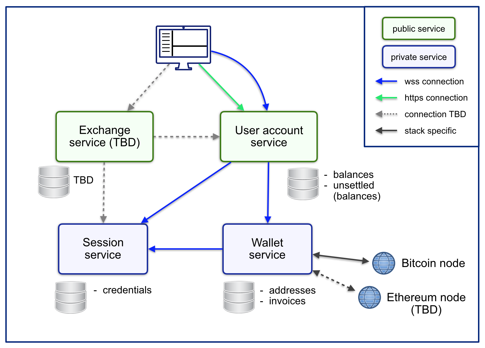

# mex

This is a trial balloon implementation of a crypto-currency exchange service. Uses 
websockets as service-to-service communication protocol.

#### Goals

How far does it go:
- get a simple exchange (btc/eth only) up and running, operating on test-networks, including:
    - deposit/withdrawals (via http interface)
    - exchange/trades (via websocket interface)
- hit it hard & repeatedly with a load testing tool (e.g. artillery) to find the breaking point(s)  

#### The Plan

<p align="center">
    
</p>


### Requirements

- Node.js v13.0 (or higher)
- MongoDB v4.0 (or higher)

Running the module-tests in `wallet-test` requires Mac OS X/Darwin (x64). To enable other OSs, 
2 lines in `wallet-test/chains/btc-node.orch.js` need to be changed: 
```
btcBinUrl: `https://bitcoincore.org/bin/bitcoin-core-${btcversion}/bitcoin-${btcversion}-osx64.tar.gz`

// and

if (os.platform() !== 'darwin') ...
```

During the first test run, `wallet-test` downloads, installs and
configures a Bitcoin regtest instance (in `wallet-test/chains/.regtest`) 

### Running

Start all services: 

`browser-test/e2ehelper.sh start` or `npm run e2e start` (which also executes `e2ehelper.sh start`)
 
Service `useraccount` is running and accessible at `localhost:13500/uac` 
A full configuration of all services is in `browser-test/orchestrator.e2e.js`.

### Testing

- `npm test` - runs all tests
- `npm run module-test` or `./run_module_tests.sh` - runs only module tests
- `npm run e2e` - runs browser tests (command-line only)
- `npm run e2e open` - runs browser tests with UI

To run module-specific tests:
- `npm run connectors-test`
- `npm run session-test`
- `npm run useraccount-test`
- `npm run utils-test`
- `npm run wallet-test`

### API documentation

For details see `README.md` in modules:
- [browser-test module](browser-test) - Cypress UI tests
- [connectors module](connectors) - Websocket server/clients, Http server
- Session service module (TBD)
- Wallet service module (TBD)
- Useraccount service module (TBD)

#### Logging

Log outputs can be configured with setting an environment variable `LOG_LEVEL`, 
using levels: `none`, `error`, `info` (default), `http`, `debug`. 
